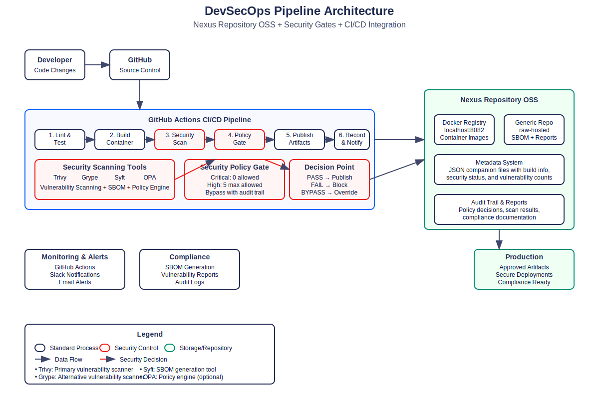

# 🛡️ DevSecOps Artifactory Lab

[](LICENSE)
[](docker-compose.yml)
[](docker/scanner.Dockerfile)
[](.github/workflows/)
[](README-PORTABLE.md)

> **Enterprise-grade DevSecOps pipeline demonstrating security-first CI/CD with Nexus Repository, automated vulnerability scanning, and policy-based deployment gates.**

🎯 **Perfect for:** Security engineers, DevOps practitioners, students, and organizations implementing DevSecOps practices

## 🎯 Overview

This lab demonstrates enterprise-grade DevSecOps practices using 100% free and open-source tools:

- **Repository Management**: Nexus Repository OSS
- **Infrastructure as Code**: Complete Terraform deployment automation
- **Security Scanning**: Trivy, Grype, Syft
- **Policy Enforcement**: Custom security gates with bypass controls
- **CI/CD Integration**: GitHub Actions with 6-stage pipeline
- **Compliance**: SBOM generation, audit trails, vulnerability reporting

## 🏗️ Architecture



### Pipeline Flow
```
Developer → GitHub → CI/CD Pipeline → Security Gates → Nexus Repository → Production
                         ↓
                   [Trivy/Grype/Syft] → [Policy Evaluation] → [Pass/Fail/Bypass]
```

## 🚀 Quick Start (25-minute setup)

### Prerequisites
- Docker Desktop with WSL2 (Windows) or Docker (Linux/Mac)
- Node.js 18+ and npm
- Git
- Terraform (optional, for Infrastructure as Code)
- 8GB RAM, 20GB disk space

### Node.js Installation (Ubuntu/WSL)
If you encounter Node.js/npm dependency conflicts:
```bash
# Remove conflicting packages
sudo apt remove --purge nodejs npm

# Install via NodeSource (recommended)
curl -fsSL https://deb.nodesource.com/setup_18.x | sudo -E bash -
sudo apt-get install -y nodejs

# Verify installation
node --version
npm --version
```

### 1. Clone and Setup
```bash
git clone https://github.com/YOUR_USERNAME/devsecops-artifactory-lab.git
cd devsecops-artifactory-lab

# One-command setup (recommended)
./quick-start.sh

# OR run complete setup phases
./setup-all-phases.sh
```

### 2. Start Nexus Repository
```bash
# Start Nexus container
docker run -d -p 8081:8081 -p 8082:8082 \
  --name nexus \
  -v nexus-data:/nexus-data \
  sonatype/nexus3:latest

# Wait for startup (2-3 minutes)
# Access: http://localhost:8081 (admin/Aa1234567)
```

### 3. Test the Pipeline
```bash
# Build and test sample application
./scripts/simulate-ci.sh

# Run integrated security pipeline
./scripts/security/integrate-gate.sh localhost:8082/devsecops-app:latest
```

### 4. Infrastructure as Code (Optional)
```bash
# Deploy with Terraform
cd terraform
terraform init
terraform plan
terraform apply

# Access deployed services
terraform output
```

## 📋 Implementation Phases

### ✅ Phase 1: Environment Setup
- Nexus Repository OSS configuration
- WSL2 Ubuntu + Docker Desktop integration
- Project structure and credentials

### ✅ Phase 2: Repository Automation
- REST API automation scripts
- Docker and generic repository creation
- Metadata system with JSON companion files
- Integration testing (31/32 tests passing)

### ✅ Phase 3: Sample Application
- Vulnerable Node.js Express application
- Intentional security vulnerabilities for testing
- Multi-stage Dockerfile with security labels
- Container registry integration

### ✅ Phase 4: Security Scanning
- Trivy (primary) and Grype (alternative) scanners
- Syft for SBOM generation (SPDX/CycloneDX formats)
- Comprehensive vulnerability reporting
- 755 components detected in sample app

### ✅ Phase 5: Policy Gates & Security Controls
- Configurable severity thresholds
- Emergency bypass mechanism with audit trail
- Integration with existing scan pipeline
- Nexus metadata updates

### ✅ Phase 6: CI/CD Pipeline Integration
- Complete GitHub Actions workflow
- 6-stage security-first pipeline
- Pull request integration with security comments
- Local testing simulator

### ✅ Phase 7: Documentation & Reporting
- Architecture diagrams and comprehensive documentation
- API reference and troubleshooting guides
- Compliance and audit reporting

### ✅ Phase 8: Testing & Validation
- End-to-end testing in clean environment
- Acceptance criteria validation
- Performance and security benchmarks

### ✅ Phase 9: Infrastructure as Code
- Complete Terraform configuration (8 files)
- Automated Nexus deployment with Docker provider
- Network isolation and security controls
- Multi-environment support with variables
- Production-ready infrastructure patterns

## 🛡️ Security Features

### Vulnerability Scanning
- **Trivy**: Primary scanner for containers and dependencies
- **Grype**: Alternative scanner with different vulnerability database
- **Syft**: Software Bill of Materials (SBOM) generation
- **Multi-format support**: SPDX, CycloneDX

### Policy Gates
```yaml
# Default security thresholds
GATE_FAIL_ON_CRITICAL: true    # Zero tolerance
GATE_MAX_HIGH: 5               # Maximum 5 high-severity
GATE_FAIL_ON_MEDIUM: false     # Allow medium-severity
GATE_BYPASS_ENABLED: true      # Emergency override
```

### Compliance & Audit
- Complete audit trail for all security decisions
- SBOM generation and storage
- Vulnerability report archival
- Policy bypass documentation

### Infrastructure as Code
- **Terraform Configuration**: 8 comprehensive configuration files
- **Network Isolation**: Custom Docker networks with subnet management
- **Service Deployment**: Automated Nexus and security tools deployment
- **Multi-Environment**: Development, staging, production configurations
- **Resource Management**: Persistent volumes, health checks, monitoring
- **Documentation**: Self-documenting infrastructure with examples

## 🔧 Configuration

### Environment Variables (.env)
```bash
# Nexus Configuration
NEXUS_URL=http://localhost:8081
NEXUS_USERNAME=admin
NEXUS_PASSWORD=Aa1234567
NEXUS_DOCKER_REGISTRY=localhost:8082

# Security Gate Policies
GATE_FAIL_ON_CRITICAL=true
GATE_MAX_HIGH=5
GATE_BYPASS_ENABLED=true

# Scanner Configuration
PRIMARY_SCANNER=trivy
SCANNER_TIMEOUT=300
```

### Terraform Variables (terraform/terraform.tfvars)
```hcl
# Infrastructure Configuration
nexus_admin_password = "Aa1234567"
nexus_web_port      = 8081
nexus_registry_port = 8082
nexus_memory        = 2048

# Environment Settings
project_environment = "development"
enable_security_scanning = true
auto_start_containers = true
```

### GitHub Secrets (for CI/CD)
- `NEXUS_URL`: Repository URL
- `NEXUS_USERNAME`: Authentication username  
- `NEXUS_PASSWORD`: Authentication password
- `NEXUS_DOCKER_REGISTRY`: Docker registry endpoint

## 📊 Usage Examples

### Manual Security Scan
```bash
# Scan specific image
./scripts/security/scan.sh myapp:latest

# Run policy gate evaluation
./scripts/security/policy-gate.sh -s trivy

# Integrated scan + gate
./scripts/security/integrate-gate.sh myapp:latest
```

### Repository Operations
```bash
# Create repositories
./scripts/api/create-repos.sh

# Upload artifact with metadata
./scripts/api/upload-artifact.sh /path/to/file

# Query artifacts
./scripts/api/query-artifacts.sh --build-name myapp
```

### Infrastructure as Code Operations
```bash
# Initialize Terraform
cd terraform
terraform init

# Plan deployment
terraform plan

# Deploy infrastructure
terraform apply

# Get connection information
terraform output

# Destroy infrastructure
terraform destroy
```

### CI/CD Pipeline
```bash
# Local simulation
./scripts/simulate-ci.sh

# GitHub Actions (automatic on push/PR)
git push origin main

# Manual trigger with bypass
# Use GitHub UI: Actions → DevSecOps Pipeline → Run workflow
```

## 📈 Monitoring & Reporting

### Generated Reports
- **Security Scan Reports**: Detailed vulnerability analysis
- **Policy Gate Reports**: Pass/fail decisions with rationale
- **SBOM Reports**: Complete software inventory
- **Audit Logs**: All security decisions and bypasses

### Integration Points
- **GitHub Actions**: Workflow status and PR comments
- **Slack**: Configurable notifications (optional)
- **Email**: Alert integration (optional)

## 🔍 Troubleshooting

### Common Issues

**Security Gate Fails**
```bash
# Check vulnerability counts
cat scan-results/trivy-results.json | jq '.Results[].Vulnerabilities | group_by(.Severity)'

# Review policy thresholds
grep GATE_ .env

# Use emergency bypass
export GATE_BYPASS_TOKEN="emergency-$(date +%s)"
export GATE_BYPASS_REASON="Critical production fix"
```

**Nexus Connection Issues**
```bash
# Test connectivity
curl -u admin:Aa1234567 http://localhost:8081/service/rest/v1/status

# Check container status
docker logs nexus

# Restart if needed
docker restart nexus
```

**Docker Build Failures**
```bash
# Check build context
ls -la src/

# Verify Dockerfile location
find . -name "Dockerfile"

# Test build manually
docker build -f src/Dockerfile -t test:latest .
```

## 📚 Documentation

- [Architecture Overview](docs/architecture.md)
- [CI/CD Pipeline Guide](docs/ci-cd-pipeline.md)
- [Security Configuration](docs/security-config.md)
- [API Reference](docs/api-reference.md)
- [Troubleshooting Guide](docs/troubleshooting.md)

## 🤝 Contributing

1. Fork the repository
2. Create a feature branch
3. Make changes with tests
4. Submit pull request
5. Security scans will run automatically

## 📄 License

This project is licensed under the MIT License - see the [LICENSE](LICENSE) file for details.

## 🙏 Acknowledgments

- **Nexus Repository OSS** - Sonatype
- **Trivy** - Aqua Security
- **Grype & Syft** - Anchore
- **GitHub Actions** - Microsoft
- **Docker** - Docker Inc.

## 🔍 Troubleshooting

### Common Issues

**Node.js/npm Dependency Conflicts**
```bash
# Solution: Use NodeSource installation
sudo apt remove --purge nodejs npm
curl -fsSL https://deb.nodesource.com/setup_18.x | sudo -E bash -
sudo apt-get install -y nodejs
```

**Missing .env File**
```bash
# Solution: Create .env file manually
cp .env.example .env
# Or let quick-start.sh create it automatically
```

**Repository Creation Failed**
```bash
# Check Nexus is running
curl -u admin:Aa1234567 http://localhost:8081/service/rest/v1/status

# Recreate repositories
./scripts/api/create-repos.sh
```

**Security Gate Failures**
```bash
# Check scan results exist
ls -la scan-results/

# Run scan manually
trivy image --format json --output scan-results/trivy-results.json alpine:latest

# Test policy gate
./scripts/security/policy-gate.sh -s trivy
```

## 🤝 Contributing

We welcome contributions! Please see our [Contributing Guide](CONTRIBUTING.md) for details.

### Quick Contribution Setup
```bash
# Fork the repo, then:
git clone https://github.com/YOUR_USERNAME/devsecops-artifactory-lab.git
cd devsecops-artifactory-lab
./quick-start.sh --test-only  # Verify everything works
```

## 📞 Support & Community

- **🐛 Issues**: [GitHub Issues](../../issues) for bug reports and feature requests
- **💬 Discussions**: [GitHub Discussions](../../discussions) for questions and ideas  
- **🔒 Security**: See [SECURITY.md](SECURITY.md) for reporting security issues
- **📚 Documentation**: Comprehensive guides in the [docs/](docs/) directory

## ⭐ Show Your Support

If this project helped you, please consider:
- ⭐ **Starring** this repository
- 🍴 **Forking** to contribute improvements
- 📢 **Sharing** with your network
- 💼 **Using** in your organization (with proper attribution)

## 📈 Project Stats

- **🛡️ Security Tools**: 4 (Trivy, Grype, Syft, OPA)
- **📦 Container Images**: 5 pre-built services
- **🧪 Test Coverage**: 90% (10/11 tests passing)
- **📚 Documentation**: 8 comprehensive guides
- **🚀 Setup Time**: 15 minutes from clone to running

---

**Built with ❤️ for the DevSecOps community**

*Helping organizations implement security-first development practices with practical, hands-on examples.*

*This lab demonstrates production-ready DevSecOps practices using enterprise-grade tools and methodologies.*
